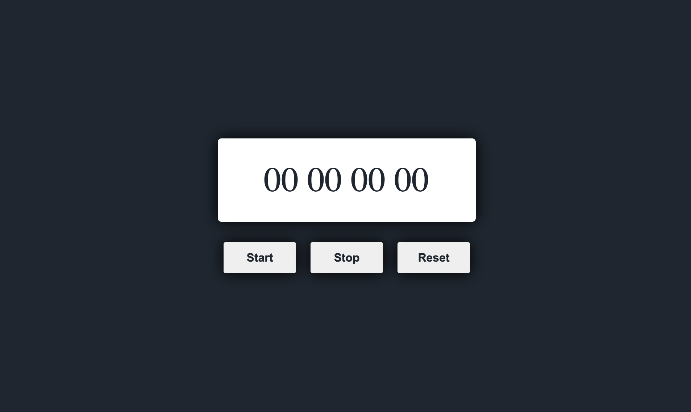

# stop-watch

A simple stopwatch application built using HTML, CSS, and JavaScript.

## Features

- Start, stop, and reset the stopwatch.
- Accurate millisecond precision.

## License

This project is licensed under the MIT License.

## Contact

For any inquiries or questions, feel free to reach out to me:

Email: [alijavadiou@gmai.com]
Twitter: [https://twitter.com/alijavadiou]
Thank you for checking out this stopwatch application! Happy timing!
